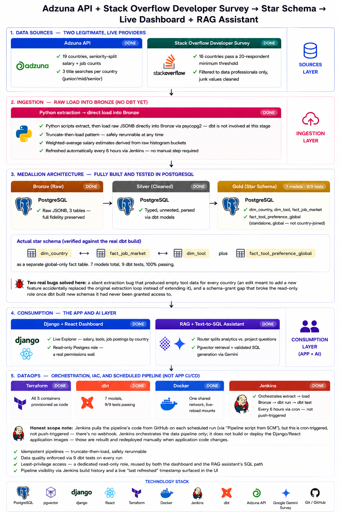
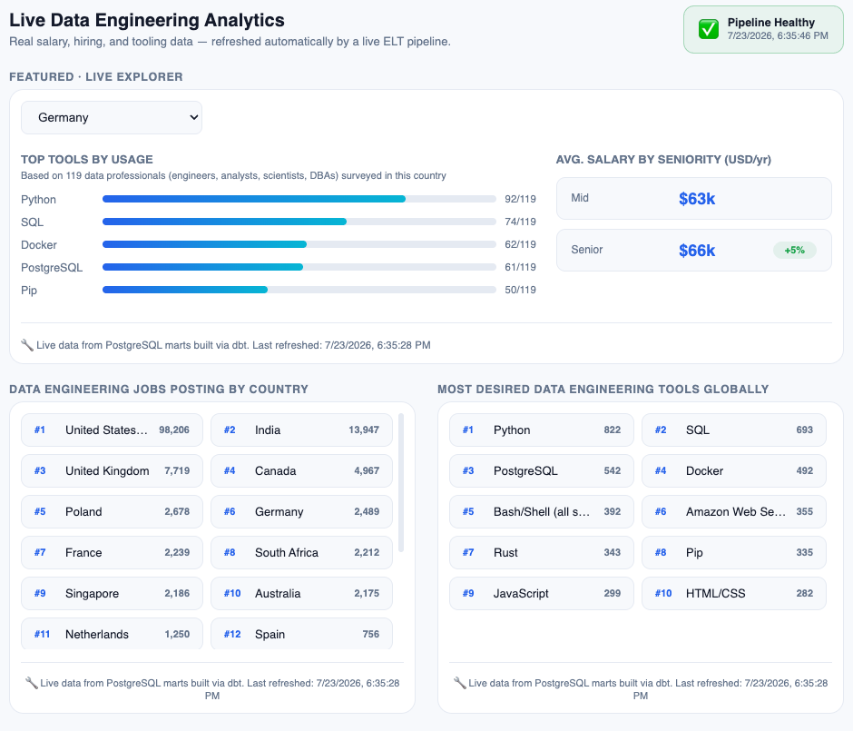
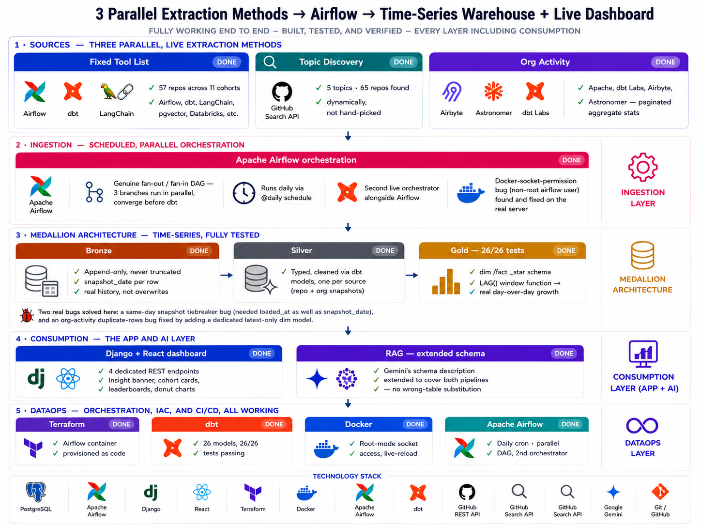
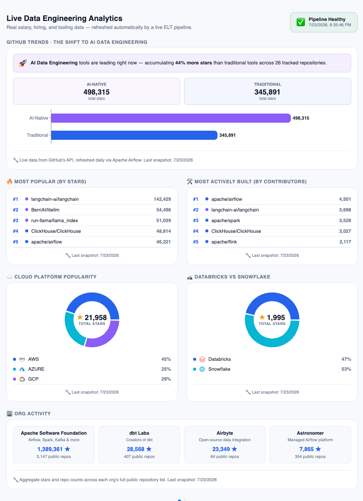
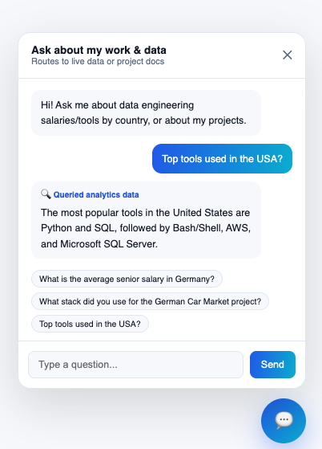
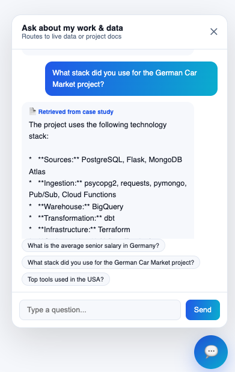

# Data Engineering Portfolio

A live, self-hosted data platform powering [aakashmanandhar.tech](https://aakashmanandhar.tech) — two independently-orchestrated pipelines sharing one Django/React/Postgres stack, plus a Gemini-powered RAG assistant spanning both.

- **Pipeline 1** — Job Market & Tools Explorer (Adzuna + Stack Overflow Survey, Jenkins, every 6 hours)
- **Pipeline 2** — GitHub Trends: The Shift to AI Data Engineering (GitHub API, Apache Airflow, daily)

---

## Repository Structure

## Pipeline Folder Structure

Both pipelines share the same repo and Postgres instance, but keep their extraction, transformation, and orchestration code separate:

```text
pipeline/
├── extraction/
│   ├── extract_adzuna.py                [P1] salary histograms + job counts, 19 countries
│   ├── extract_so_survey.py             [P1] Stack Overflow Developer Survey
│   ├── load_bronze.py                   [P1] loads both P1 sources into bronze
│   ├── data/
│   │   └── so_survey_2025.csv           [P1] raw survey export
│   │
│   ├── extract_github.py                [P2] fixed-list extraction, 57 repos across 11 cohorts
│   ├── discover_github_topics.py        [P2] GitHub Search API, 65 dynamically-found repos
│   ├── extract_github_orgs.py           [P2] paginated org aggregate stats (4 orgs)
│   ├── load_bronze_github.py            [P2]
│   ├── load_bronze_github_discovery.py  [P2]
│   ├── load_bronze_github_orgs.py       [P2]
│   │
│   ├── embed_case_studies.py            [RAG] embeds case study content into pgvector
│   └── test_adzuna.py, test_gemini.py, test_router.py   - ad hoc verification scripts
│
├── dbt/
│   ├── dbt_project.yml
│   ├── profiles.yml                     - Postgres connection (not committed)
│   ├── Dockerfile
│   ├── seeds/
│   │   └── country_mapping.csv          [P1] Adzuna code → country name bridge
│   └── models/
│       ├── silver/
│       │   ├── silver_job_market.sql              [P1]
│       │   ├── silver_tool_usage.sql               [P1]
│       │   ├── silver_preferred_tools_global.sql   [P1]
│       │   ├── silver_github_repo_snapshot.sql      [P2]
│       │   ├── silver_github_org_snapshot.sql       [P2]
│       │   └── sources.yml                          - registers bronze tables, BOTH pipelines
│       └── gold/
│           ├── dim_country.sql, dim_tool.sql        [P1]
│           ├── fact_job_market.sql                  [P1]
│           ├── fact_tool_preference_global.sql      [P1]
│           ├── dim_github_repo.sql                  [P2] latest snapshot per repo
│           ├── dim_github_org.sql                   [P2] latest snapshot per org
│           ├── fact_github_repo_trend.sql           [P2] LAG()-based star growth
│           ├── fact_github_org_trend.sql            [P2]
│           └── schema.yml                            - tests for BOTH pipelines
│
└── airflow/
    └── dags/
        └── github_trends_dag.py         [P2] 3-branch parallel fan-out/fan-in DAG

infra/
├── jenkins/
│   ├── Dockerfile                       [P1] custom image, Docker CLI + socket mount
│   └── Jenkinsfile                      [P1] extract → load bronze → dbt run → dbt test
│
├── airflow/
│   ├── Dockerfile                       [P2] apache/airflow base + extra deps
│   └── requirements.txt                 [P2]
│
├── postgres-init/                       - shared, both pipelines
│   ├── 01-enable-pgvector.sql
│   ├── 02-create-readonly-role.sql
│   ├── 03-create-pipeline-schemas.sql
│   ├── 04-create-bronze-tables.sql       - includes tables for BOTH pipelines
│   ├── 05-grant-readonly-dbt-schemas.sql
│   └── 06-create-airflow-db.sql         [P2] airflow_meta database
│
└── terraform/
    └── main.tf                          - every container as code, BOTH pipelines
```

---

## Pipeline 1 — Job Market & Tools Explorer

Real salary, hiring, and tooling data across 20 countries, refreshed automatically every 6 hours.

### Architecture



## Analytics Dashboard


### Data Sources

- **Adzuna API** — salary histograms + job counts, 19 countries, 3 seniority-level searches per country (junior/mid/senior)
- **Stack Overflow Developer Survey 2025** — tool usage + self-reported salary, filtered to 16 countries with 20+ data-professional respondents

### Gold-Layer Star Schema

- `dim_country` — 20 rows (Adzuna's 19 + Ukraine, via `country_mapping` seed)
- `dim_tool` — 19 unique tools
- `fact_job_market` — seniority-level job counts + salary, cross-referenced against SO Survey
- `fact_tool_preference_global` — standalone global tool ranking (not per-country)

### Setup — Local

```bash
# .env at repo root (gitignored)
ADZUNA_APP_ID=your_app_id
ADZUNA_APP_KEY=your_app_key

# Run extraction + load + transform manually once, to seed data
docker exec portfolio_django python extract_adzuna.py
docker exec portfolio_django python extract_so_survey.py
docker exec portfolio_django python load_bronze.py
docker exec portfolio_dbt dbt run
docker exec portfolio_dbt dbt test
```

### Scheduling — Jenkins

Job type: **Pipeline script from SCM** → this repo, branch `main`, script path `infra/jenkins/Jenkinsfile`.
Cron: `H */6 * * *` (every 6 hours, jittered start minute).

Stages: `Extract Adzuna` → `Load Bronze` → `dbt run` → `dbt test`, with a `post { success/failure }` block writing a `PipelineRun` record for the site's Pipeline Health widget.

### API Endpoints

| Endpoint | Returns |
|---|---|
| `GET /api/job-market/` | Job counts + salary by country/seniority |
| `GET /api/tool-usage/` | Tool usage by country |
| `GET /api/tool-preference-global/` | Global tool ranking |
| `GET /api/last-refreshed/` | Timestamp of the most recent bronze load |
| `GET /api/pipeline-runs/` | Recent Jenkins run history (health widget) |

---

## Pipeline 2 — GitHub Trends: The Shift to AI Data Engineering

Tracks real GitHub activity across traditional vs. AI-native data engineering tools, cloud provider popularity, and Databricks vs. Snowflake — refreshed daily via a second, independent orchestrator.

## Architecture


## Analytics Dashboard


### Cohorts Tracked

| Cohort | Examples |
|---|---|
| `traditional` | Airflow, dbt-core, Spark, Kafka, Airbyte, Dagster, Flink, NiFi, Great Expectations, Meltano, Prefect, DuckDB, ClickHouse, Trino |
| `ai` | LangChain, LlamaIndex, pgvector, Weaviate, Milvus, MLflow, Haystack, Qdrant, Chroma, Feast, Ray, LiteLLM |
| `platform-databricks` / `platform-snowflake` | Official SDKs + dbt adapters |
| `cloud-azure` / `cloud-aws` / `cloud-gcp` | Official SDKs + relevant dbt adapters |
| `rdbms` / `nosql` / `lakehouse` / `language` / `analytics-bi` | Postgres, MySQL, MongoDB, Redis, Delta Lake, Iceberg, Python, Rust, Superset, Grafana |
| `topic-<name>` | Dynamically discovered via GitHub Search API across 5 topics |

### Prerequisites

- GitHub Personal Access Token (classic, scope: `public_repo` only) — [github.com/settings/tokens](https://github.com/settings/tokens)

### Setup — Local

```bash
# .env at repo root (gitignored)
echo "GITHUB_TOKEN=ghp_your_real_token_here" >> .env

# Airflow metadata DB (one time)
docker exec portfolio_postgres psql -U postgres -c "CREATE DATABASE airflow_meta;"

# Build the Airflow image
docker build -t portfolio-airflow:latest infra/airflow

# Provision the Airflow container
cd infra/terraform
terraform apply

# Log into http://localhost:8081 — if the configured password doesn't work
# (standalone mode sometimes generates its own on first boot):
docker exec portfolio_airflow airflow users list
docker exec -it portfolio_airflow airflow users reset-password --username admin --password <your-choice>

# Unpause and trigger
docker exec portfolio_airflow airflow dags unpause github_trends_pipeline
docker exec portfolio_airflow airflow dags trigger github_trends_pipeline

# Verify
docker exec portfolio_airflow airflow dags list-runs -d github_trends_pipeline
curl -s http://localhost:8000/api/github-repos/ | python3 -m json.tool | head -20
```

### ⚠️ Docker Socket Permission Gotcha

Airflow's official image runs as a non-root user (`uid=50000`). On a real Linux host, this user cannot access `/var/run/docker.sock` (owned by the `docker` group) even with the socket mounted — Docker Desktop on Mac is more permissive and won't surface this. **Fix:** add `user = "root"` to the `docker_container "airflow"` block in `main.tf`, mirroring the same fix already in place for Jenkins.

### DAG Structure

```
extract_github_fixed ──┐
discover_github_topics ─┼──▶ load_bronze_* (respective) ──▶ dbt_run ──▶ dbt_test
extract_github_orgs ────┘
```

Three branches run in **genuine parallel** (Airflow's fan-out), converge before a shared `dbt run`/`dbt test` (fan-in). Schedule: `@daily`.

### API Endpoints

| Endpoint | Returns |
|---|---|
| `GET /api/github-repos/` | All tracked repos: cohort, stars, forks, contributor_count, language |
| `GET /api/github-cohort-trend/` | Daily star totals by cohort, for trend charting |
| `GET /api/github-platforms/` | Repos in `cloud-*` and `platform-*` cohorts |
| `GET /api/github-orgs/` | Org aggregates: total repos, stars, forks, top repos |

### Notable Design Decisions

- **Contributor count** (via `/contributors?per_page=1` + parsing the `Link` header's last page number) is the "adoption for building" signal — GitHub has no direct field for this, and no official API for "used by"/dependents counts exists at all.
- **Abandoned PyPI download stats** as an alternative — `pypistats.org` enforces a strict ~30 requests/minute IP-based limit that repeatedly 429'd.
- **Time-series tiebreaking**: gold models use `ORDER BY snapshot_date DESC, loaded_at DESC` — required, since Postgres's ordering for same-day duplicate snapshots is otherwise non-deterministic.

---

## Shared Infrastructure

- **PostgreSQL** (+pgvector) — one instance, separate bronze/gold schemas per pipeline
- **Docker + Terraform** — every service is a container, provisioned as code
- **Nginx + Cloudflare** — reverse proxy + free HTTPS in front of the VPS
- **Two orchestrators, deliberately** — Jenkins for Pipeline 1's simple linear cron job; Airflow for Pipeline 2, where a genuine parallel dependency graph and time-series scheduling matter

## RAG Assistant

A chat widget on the live site, powered by Google's Gemini API, routing each question to one of two paths:

- **Text-to-SQL** — generates and executes read-only SQL against either pipeline's gold schema, with automatic retry-on-error for occasional LLM-generated SQL typos
- **Vector retrieval (pgvector)** — grounds answers in embedded case study content, explicitly trained to say "I don't know" rather than hallucinate




## Full Tech Stack

Django · Django REST Framework · React · PostgreSQL · pgvector · dbt · Terraform · Docker · Jenkins · Apache Airflow · Nginx · Cloudflare · Google Gemini API · Adzuna API · GitHub REST API · GitHub Search API · Stack Overflow Developer Survey

---

Live at **[aakashmanandhar.tech](https://aakashmanandhar.tech)** · Architecture deep-dive at [`/architecture`](https://aakashmanandhar.tech/architecture)