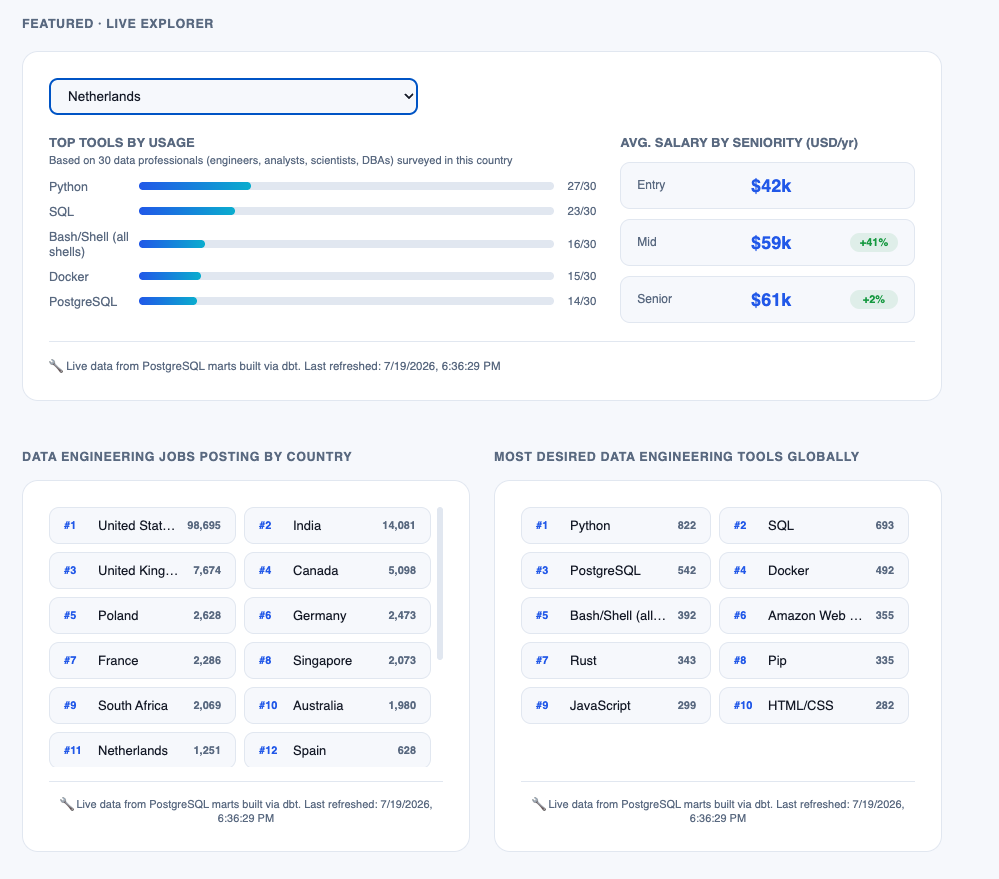

# Data Engineering Tools & Salary Explorer + RAG Assistant

A self-hosted, end-to-end data platform: a real ELT pipeline sourcing live salary and job-market data from two legitimate providers, a full-stack Django + React dashboard, and a dual-path RAG + text-to-SQL AI assistant — all provisioned as code, containerized, and kept running on a schedule.

Everything in this README documents what was actually built, in the order it was built, including the real bugs hit and how they were fixed — not a cleaned-up retrospective.

## What this project demonstrates

- **Medallion architecture** (Bronze/Silver/Gold) in PostgreSQL, built entirely with dbt, tested on every run
- A **star schema** (`dim_country`, `dim_tool`, `fact_job_market`) fed by two independently-sourced, legitimately-obtained datasets
- **Honest data engineering**: a hard-coded minimum-sample-size threshold means countries without enough data show "not enough data" instead of a fabricated number
- **Infrastructure as code** (Terraform), **containerization** (Docker), and **scheduled orchestration** (Jenkins, every 6 hours, Docker-in-Docker)
- A full **Django + React** application: a CMS with a GitHub-import feature, dynamic (admin-editable) hero/profile/about content, PDF uploads, and a live analytics dashboard
- A working **RAG + text-to-SQL assistant** (Google Gemini + pgvector) with a real chat widget, routing between live data queries and project documentation

---

## Architecture overview

```
SOURCES                    PIPELINE (ELT)                       SERVING
┌──────────────┐
│ Adzuna API   │──extract──┐
│ (19 countries)│          │
└──────────────┘           ├──▶ Bronze (raw JSONB) ──▶ Silver (typed) ──▶ Gold (star schema)
┌──────────────┐           │       dbt + Postgres          dbt models          dim_country
│ SO Survey     │──extract──┘                                                  dim_tool
│ (CSV, 16 countries)                                                          fact_job_market
└──────────────┘

Jenkins (every 6h, Docker-in-Docker) ──▶ extract → load bronze → dbt run → dbt test

                              CONSUMPTION
Gold layer ──▶ Django (read-only role) ──▶ React dashboard (live Explorer, charts)
           └─▶ pgvector embeddings ──▶ RAG + text-to-SQL chat assistant (Gemini)
```


---

## Project folder structure

```text
data-eng-portfolio/
├── .env                                  - all local secrets (not committed)
├── .gitignore
├── README.md
│
├── infra/
│   ├── terraform/
│   │   └── main.tf                       - all 5 containers: Postgres, Jenkins, Django, React, dbt
│   ├── postgres-init/
│   │   ├── 01-enable-pgvector.sql
│   │   ├── 03-create-pipeline-schemas.sql
│   │   ├── 04-create-bronze-tables.sql
│   │   └── 05-grant-readonly-dbt-schemas.sql
│   └── jenkins/
│       ├── Dockerfile                    - custom image, Docker CLI installed
│       └── Jenkinsfile                   - 4-stage pipeline, cron every 6h
│
├── pipeline/
│   ├── extraction/
│   │   ├── extract_adzuna.py             - 19 countries × 3 seniority levels
│   │   ├── extract_so_survey.py          - filtered, thresholded, cleaned
│   │   ├── load_bronze.py                - idempotent (truncate-then-load)
│   │   ├── embed_case_studies.py         - chunk + embed README/case study text
│   │   └── data/                         - raw SO Survey CSV (gitignored, ~134MB)
│   └── dbt/
│       ├── Dockerfile
│       ├── dbt_project.yml
│       ├── profiles.yml                  - Postgres connection (gitignored)
│       ├── seeds/
│       │   └── country_mapping.csv       - bridges Adzuna codes ↔ SO Survey names
│       └── models/
│           ├── silver/
│           │   ├── sources.yml
│           │   ├── silver_job_market.sql
│           │   ├── silver_tool_usage.sql
│           │   └── silver_preferred_tools_global.sql
│           └── gold/
│               ├── schema.yml            - 9 dbt tests
│               ├── dim_country.sql
│               ├── dim_tool.sql
│               ├── fact_job_market.sql
│               └── fact_tool_preference_global.sql
│
├── docs/                                 - architecture diagram, dashboard + RAG screenshots
│
├── apps/
│   ├── api/                              - Django backend
│   │   ├── Dockerfile
│   │   ├── requirements.txt
│   │   ├── config/
│   │   │   ├── settings.py               - CORS, .env loading, DB config
│   │   │   └── urls.py
│   │   ├── content/                      - CMS: case studies, ADRs, blog, profile
│   │   │   ├── models.py                 - CaseStudy, ADR, ProfileStatus (singleton), ContactMessage
│   │   │   ├── admin.py                  - includes the GitHub-import action
│   │   │   ├── serializers.py
│   │   │   ├── views.py
│   │   │   └── urls.py
│   │   ├── analytics/                    - dashboard data endpoints
│   │   │   ├── views.py                  - job-market, tool-usage, last-refreshed
│   │   │   └── urls.py
│   │   └── rag/                          - the AI assistant
│   │       ├── models.py                 - Embedding (pgvector)
│   │       ├── services.py               - router, text-to-SQL, RAG retrieval
│   │       ├── views.py                  - /api/ask/
│   │       └── urls.py
│   │
│   └── web/                              - React frontend
│       ├── Dockerfile
│       ├── package.json
│       ├── public/
│       │   └── icons/                    - self-hosted logos (sql, azure, fabric, dbt, airflow)
│       └── src/
│           ├── App.jsx                   - router
│           ├── App.css
│           ├── pages/
│           │   ├── HomePage.jsx          - hero, Explorer, dual charts, ADRs, contact
│           │   └── CaseStudyDetailPage.jsx
│           └── components/
│               └── ChatWidget.jsx        - floating RAG chat, real /api/ask/ calls
```

---

## The full process, in the order it was actually built

### Part 0 — Tooling setup (Mac)

```bash
# Docker Desktop — install from docker.com, then confirm:
docker --version
docker ps

# VS Code CLI shortcut (if `code .` doesn't work):
# Cmd+Shift+P → "Shell Command: Install 'code' command in PATH"
```

Everything after this runs containerized — **no local Python or Node install needed**.

### Part 1 — Infrastructure (Terraform + Docker)

```bash
mkdir -p data-eng-portfolio/infra/terraform
cd data-eng-portfolio/infra/terraform
terraform init
```

`main.tf` provisions, in order: a shared Docker network, Postgres (`pgvector/pgvector:pg16`, port 5433 externally), Jenkins (custom image, see Part 8), Django, React, and dbt — each with its own `docker_container` resource, joined to the same network so they reach each other by container name.

```bash
terraform apply
docker ps   # should show all 5 containers Up
```

**Real issue solved**: Terraform's `kreuzwerker/docker` provider hung indefinitely (10+ minutes, no error) building the Django and React images specifically, even though the Dockerfiles themselves were correct — a direct `docker build` of the same context succeeded in under 10 seconds. Fixed by building images manually and referencing them in Terraform via `keep_locally = true` instead of a `build` block:
```bash
docker build -t portfolio-django:latest apps/api
terraform apply -replace="docker_container.django"
```

**Real issue solved**: local port 5432 was already in use by another Postgres instance on the Mac. Remapped the container's external port to 5433 instead of hunting down and stopping the conflicting process.

### Part 2 — PostgreSQL + pgvector

```bash
docker exec -it portfolio_postgres psql -U postgres -d portfolio -c "CREATE EXTENSION IF NOT EXISTS vector;"
docker exec -it portfolio_postgres psql -U postgres -d portfolio -c "CREATE SCHEMA IF NOT EXISTS bronze; CREATE SCHEMA IF NOT EXISTS silver; CREATE SCHEMA IF NOT EXISTS gold;"
```

Also made reproducible via `infra/postgres-init/*.sql`, auto-run on a genuinely fresh volume via Postgres's `/docker-entrypoint-initdb.d` convention.

A dedicated **read-only role** was created for safe, sandboxed querying — later reused by both the dashboard's analytics endpoints and the RAG assistant's text-to-SQL path:
```sql
CREATE ROLE readonly_user WITH LOGIN PASSWORD '...';
GRANT CONNECT ON DATABASE portfolio TO readonly_user;
GRANT USAGE ON SCHEMA public TO readonly_user;
GRANT SELECT ON ALL TABLES IN SCHEMA public TO readonly_user;
ALTER DEFAULT PRIVILEGES IN SCHEMA public GRANT SELECT ON TABLES TO readonly_user;
```

**Real issue solved**: the read-only role could query `silver`/`gold` but not `bronze`, causing a live 500 error on the "last refreshed" endpoint — the original grants never covered `bronze`. Fixed with an explicit `GRANT`, plus `ALTER DEFAULT PRIVILEGES FOR ROLE postgres` so future `dbt run`s (which drop and recreate tables on every run) can't silently revoke access again.

### Part 3 — Data extraction

```bash
pip install requests python-dotenv   # inside the Django container
```

`extract_adzuna.py` runs 3 separate title searches per country (`junior data engineer` / `data engineer` / `senior data engineer`) across 19 countries, deriving a weighted-average salary estimate from each returned histogram:
```bash
docker exec -w /tmp -it portfolio_django python extract_adzuna.py
```

**Real issue solved**: the initially-assumed 16-country Adzuna list was outdated — the live API's own error response revealed the actual 19 supported countries (dropping Russia, adding Belgium, Switzerland, Spain, New Zealand). Fixed by trusting the API's authoritative error message over secondhand documentation.

`extract_so_survey.py` processes the official Stack Overflow Developer Survey CSV, filtered to data professionals (engineers, analysts, scientists, DBAs), gated by a hard **20-respondent minimum threshold** per country:
```bash
python3 extract_so_survey.py
```

**Real issue solved**: the CSV's free-text fields exceeded Python's default `csv` field-size limit — fixed with `csv.field_size_limit(10_000_000)`.

**Real issue solved (the most consequential bug in the whole build)**: an edit meant to add global tool-preference tracking accidentally *replaced*, rather than extended, the original per-country extraction loop — the pipeline reported success while silently producing zero usable tool data for every country. Caught only by directly querying the database for real row counts, not by trusting the script's own success message.

### Part 4 — Bronze layer

```bash
docker exec -it portfolio_postgres psql -U postgres -d portfolio -f infra/postgres-init/04-create-bronze-tables.sql
python load_bronze.py
```

**Real issue solved**: the first version of the loader wasn't idempotent — re-running it duplicated every row. Fixed by adding `TRUNCATE` at the top of the script before every load, matching the same pattern used throughout this build.

### Part 5 — dbt (Silver + Gold, star schema)

```bash
pip install dbt-postgres==1.9.0   # inside the dbt container
dbt debug
```

Silver models parse and type the raw JSONB (`raw_data->>'field'`, `LATERAL jsonb_array_elements` for unnesting arrays). Gold models build the actual star schema, bridging Adzuna's country codes and the Survey's full country names via a dedicated `country_mapping.csv` seed:
```bash
dbt seed
dbt run
dbt test
```

**Real issue solved**: `dbt debug` failed a required-dependency check for `git`, since the base `python:3.12-slim` image doesn't include it. Fixed by adding `apt-get install -y git` to the dbt Dockerfile.

### Part 6 — Django backend

```bash
docker run --rm -v "$(pwd)/apps/api:/app" -w /app python:3.12-slim sh -c "pip install django djangorestframework psycopg2-binary && django-admin startproject config ."
python manage.py startapp content
python manage.py startapp analytics
python manage.py startapp rag
python manage.py migrate
```

Key models: `CaseStudy` (with a GitHub-import admin action fetching README + metadata, rewriting relative image paths to real `raw.githubusercontent.com` URLs), `ADR`, `ProfileStatus` (a singleton — `save()` always writes to `pk=1` — powering the dynamic hero headline, status, "now building" text, resume, and photo), `ContactMessage`, and `Embedding` (pgvector-backed, for RAG).

```bash
pip install django-cors-headers   # needed once React started calling the API
```

**Real issue solved**: `.env` couldn't be mounted directly inside the already-mounted `apps/api` directory (a Docker rootfs mount conflict). Fixed by mounting to a separate `/secrets/.env` path and pointing `load_dotenv('/secrets/.env')` there explicitly.

### Part 7 — React frontend

```bash
docker run --rm -v "$(pwd)/apps/web:/app" -w /app node:20-slim sh -c "npm create vite@latest . -- --template react && npm install"
npm install react-router-dom react-markdown
```

`HomePage.jsx` fetches everything live from Django: case studies, ADRs, profile status, job-market data, tool usage, global tool preferences, and the pipeline's "last refreshed" timestamp — nothing on the live site is hardcoded.

**Real issue solved**: a duplicate `useState` import (introduced when adding `useEffect` to the same line) silently broke the entire `ChatWidget` component with no visible error — isolated by testing the click handler in isolation with a diagnostic `alert()` before finding the actual JavaScript module error.



### Part 8 — Jenkins (Docker-in-Docker CI/CD)

A custom Jenkins image extends the official base with the Docker CLI installed via Docker's own apt repository:
```dockerfile
RUN apt-get update && apt-get install -y docker-ce-cli
```
The container mounts the host's Docker socket (`/var/run/docker.sock`) and runs as `root`, giving Jenkins direct control over the pipeline's sibling containers. A 4-stage `Jenkinsfile` (extract → load Bronze → `dbt run` → `dbt test`) runs on a cron schedule:
```groovy
triggers { cron('H */6 * * *') }
```
Verified with a live manual "Build Now" trigger, confirmed by checking the Bronze layer's `loaded_at` timestamp against the actual build completion time.

### Part 9 — RAG + text-to-SQL assistant

```bash
pip install google-genai
```

Case study content is chunked (paragraph-aware, ~1,500 characters) and embedded via `gemini-embedding-001` (explicitly set to 1536 output dimensions to match the `pgvector` schema):
```bash
python embed_case_studies.py
```

A router (one Gemini call) classifies each question as `analytics` or `project`. Analytics questions generate real SQL against the Gold schema, validated against a safety allowlist, executed via the read-only role. Project questions embed the query and retrieve the closest chunks via pgvector's `<->` distance operator, answering strictly from that retrieved context.

**Real issue solved**: OpenAI was the original provider, but hit a genuine `insufficient_quota` billing wall with no meaningful free tier — switched to Google's Gemini API instead.

**Real issue solved**: the initially-adopted `gemini-flash-latest` alias resolved to `gemini-3.5-flash`, which turned out to carry a crippling 20-requests/day free-tier quota — discovered via live testing, not documentation. Fixed by switching to `gemini-flash-lite-latest`, both resolving the quota wall and future-proofing against the next model deprecation cycle.


---

## Full setup — reproducing this from scratch

1. Install Docker Desktop
2. `git clone` this repo
3. Get your own free API keys: [Adzuna](https://developer.adzuna.com/) and [Google AI Studio](https://aistudio.google.com/) (Gemini)
4. Create `.env` at the project root with `ADZUNA_APP_ID`, `ADZUNA_APP_KEY`, `GEMINI_API_KEY`
5. `cd infra/terraform && terraform init && terraform apply`
6. Enable pgvector + create schemas (Part 2 commands above)
7. Build and start Django/React images (`docker build`, then `terraform apply -replace=...`)
8. `python manage.py migrate` (inside the Django container)
9. Run the extraction scripts (Part 3), then `load_bronze.py`
10. `dbt seed && dbt run && dbt test` (inside the dbt container)
11. `python embed_case_studies.py` to populate the RAG assistant's knowledge
12. Complete the Jenkins setup wizard at `localhost:8080`, create the pipeline job pointing at `infra/jenkins/Jenkinsfile`
13. Visit `localhost:5173` — the full site, live data, and chat assistant should all be working

---

## Complete technology stack

| Layer | Tools |
|---|---|
| Data sources | Adzuna API, Stack Overflow Developer Survey |
| Pipeline | Python, PostgreSQL, dbt |
| Infrastructure | Terraform, Docker |
| Orchestration | Jenkins (Docker-in-Docker) |
| Backend | Django, Django REST Framework |
| Frontend | React, React Router, react-markdown |
| Vector store | pgvector |
| AI | Google Gemini (`gemini-embedding-001`, `gemini-flash-lite-latest`) |
| Version control | Git, GitHub |

## What's next

- Mine Adzuna job-posting description text for tool mentions, extending tool-usage coverage to all 19 countries instead of the 16 the survey alone supports
- Deploy to a real public host (Hetzner or Oracle Cloud Free Tier under consideration)