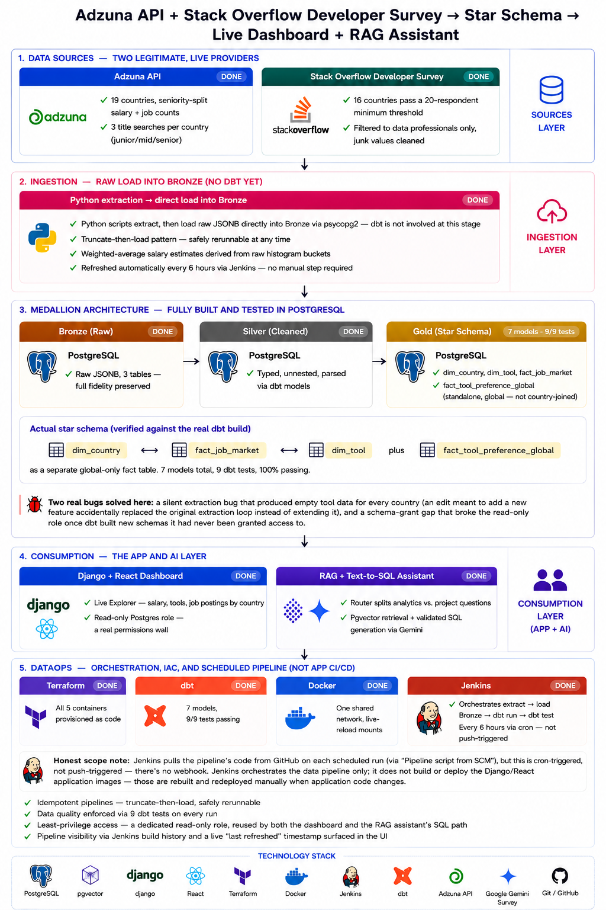
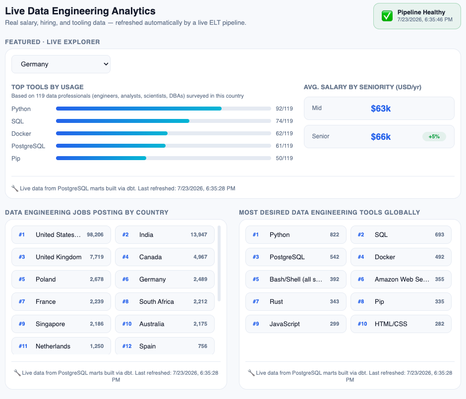
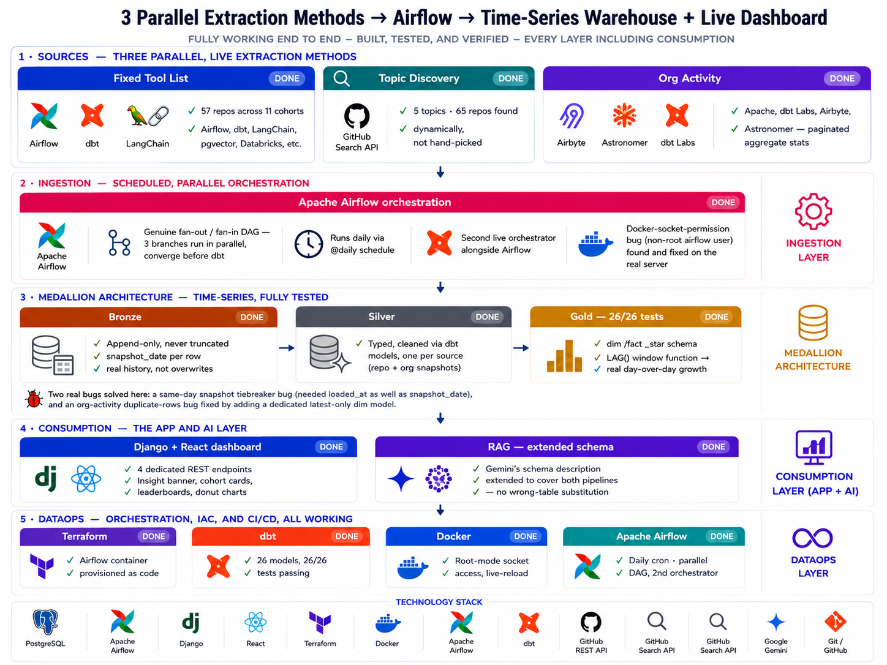
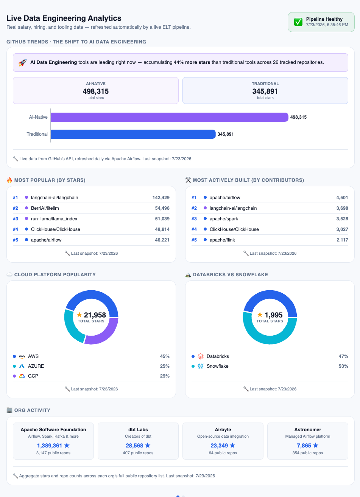
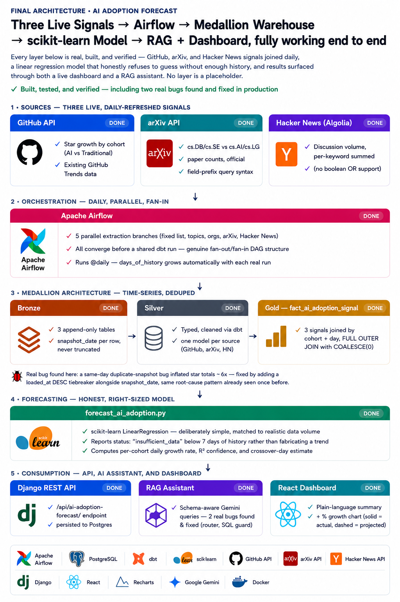
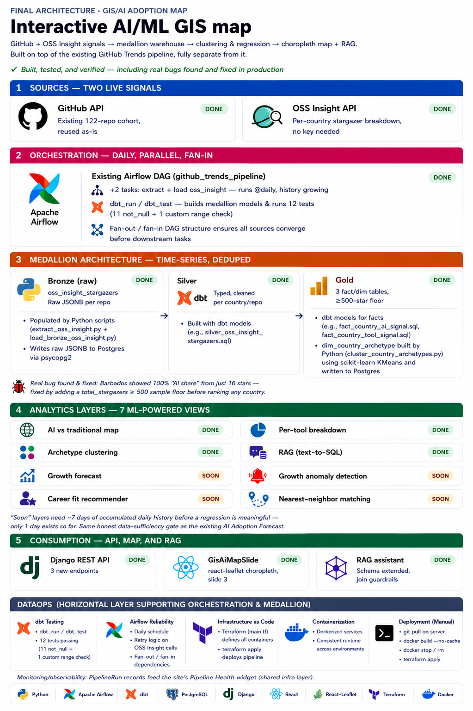
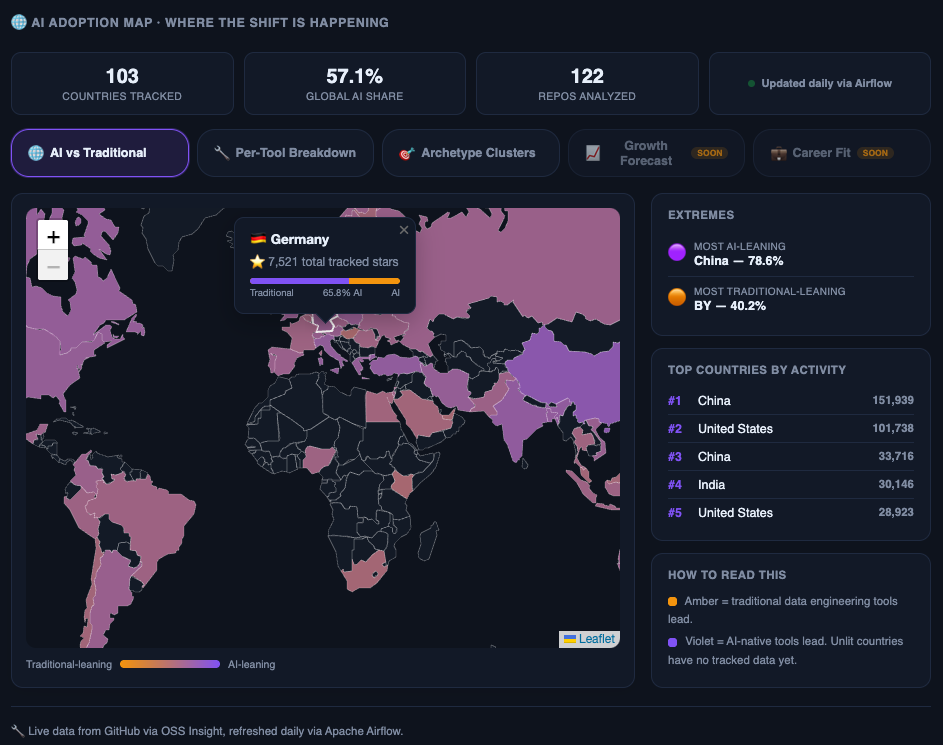
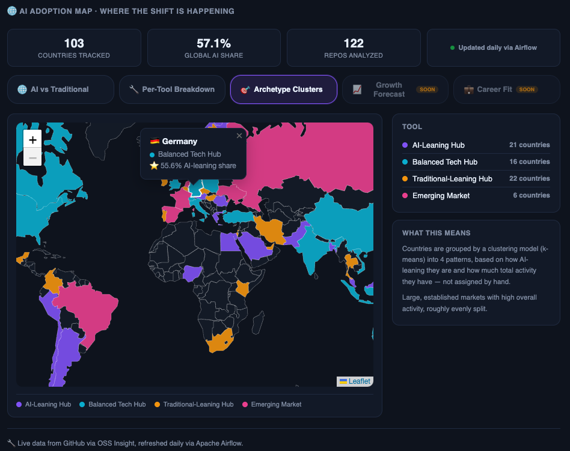
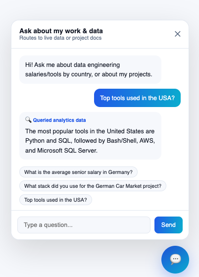
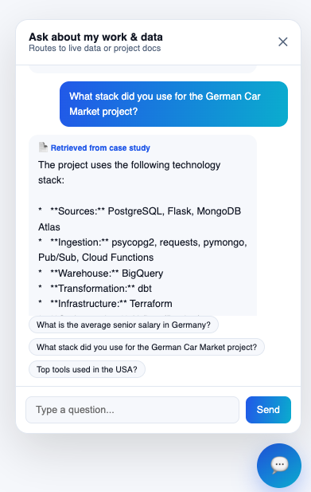

# Data Engineering Portfolio

A live, self-hosted data platform powering [aakashmanandhar.tech](https://aakashmanandhar.tech) — two independently-orchestrated pipelines sharing one Django/React/Postgres stack, plus a Gemini-powered RAG assistant spanning both.

- **Pipeline 1** — Job Market & Tools Explorer (Adzuna + Stack Overflow Survey, Jenkins, every 6 hours)
- **Pipeline 2** — GitHub Trends: The Shift to AI Data Engineering (GitHub API, Apache Airflow, daily)

---

## Repository Structure

## Pipeline Folder Structure

Both pipelines share the same repo and Postgres instance, but keep their extraction, transformation, and orchestration code separate:

```text
pipeline/
├── extraction/
│   ├── extract_adzuna.py                [P1] salary histograms + job counts, 19 countries
│   ├── extract_so_survey.py             [P1] Stack Overflow Developer Survey
│   ├── load_bronze.py                   [P1] loads both P1 sources into bronze
│   ├── data/
│   │   └── so_survey_2025.csv           [P1] raw survey export
│   │
│   ├── extract_github.py                [P2] fixed-list extraction, 57 repos across 11 cohorts
│   ├── discover_github_topics.py        [P2] GitHub Search API, 65 dynamically-found repos
│   ├── extract_github_orgs.py           [P2] paginated org aggregate stats (4 orgs)
│   ├── load_bronze_github.py            [P2]
│   ├── load_bronze_github_discovery.py  [P2]
│   ├── load_bronze_github_orgs.py       [P2]
│   │
│   ├── extract_arxiv.py                 [Forecast] cs.DB/cs.SE vs cs.AI/cs.LG paper counts
│   ├── extract_hackernews.py            [Forecast] Algolia search API, per-keyword summed
│   ├── load_bronze_arxiv.py             [Forecast]
│   ├── load_bronze_hackernews.py        [Forecast]
│   ├── forecast_ai_adoption.py          [Forecast] scikit-learn linear regression, honest data-sufficiency gate
│   │
│   ├── embed_case_studies.py            [RAG] embeds case study content into pgvector
│   └── test_adzuna.py, test_gemini.py, test_router.py   - ad hoc verification scripts
│
├── dbt/
│   ├── dbt_project.yml
│   ├── profiles.yml                     - Postgres connection (not committed)
│   ├── Dockerfile
│   ├── seeds/
│   │   └── country_mapping.csv          [P1] Adzuna code → country name bridge
│   └── models/
│       ├── silver/
│       │   ├── silver_job_market.sql              [P1]
│       │   ├── silver_tool_usage.sql               [P1]
│       │   ├── silver_preferred_tools_global.sql   [P1]
│       │   ├── silver_github_repo_snapshot.sql      [P2]
│       │   ├── silver_github_org_snapshot.sql       [P2]
│       │   ├── silver_arxiv_snapshot.sql            [Forecast]
│       │   ├── silver_hackernews_snapshot.sql       [Forecast]
│       │   └── sources.yml                          - registers bronze tables, ALL sources
│       └── gold/
│           ├── dim_country.sql, dim_tool.sql        [P1]
│           ├── fact_job_market.sql                  [P1]
│           ├── fact_tool_preference_global.sql      [P1]
│           ├── dim_github_repo.sql                  [P2] latest snapshot per repo (deduped)
│           ├── dim_github_org.sql                   [P2] latest snapshot per org (deduped)
│           ├── fact_github_repo_trend.sql           [P2] LAG()-based star growth (deduped)
│           ├── fact_github_org_trend.sql            [P2]
│           ├── fact_ai_adoption_signal.sql          [Forecast] GitHub+arXiv+HN joined by cohort/day
│           └── schema.yml                            - tests for every model above
│
└── airflow/
    └── dags/
        └── github_trends_dag.py         [P2+Forecast] 5-branch parallel fan-out/fan-in DAG,
                                          dbt run/test, then forecast_ai_adoption.py

infra/
├── jenkins/
│   ├── Dockerfile                       [P1] custom image, Docker CLI + socket mount
│   └── Jenkinsfile                      [P1] extract → load bronze → dbt run → dbt test
│
├── airflow/
│   ├── Dockerfile                       [P2] apache/airflow base + extra deps
│   └── requirements.txt                 [P2]
│
├── postgres-init/                       - shared, all pipelines
│   ├── 01-enable-pgvector.sql
│   ├── 02-create-readonly-role.sql
│   ├── 03-create-pipeline-schemas.sql
│   ├── 04-create-bronze-tables.sql       - includes tables for ALL sources
│   ├── 05-grant-readonly-dbt-schemas.sql
│   └── 06-create-airflow-db.sql         [P2] airflow_meta database
│
└── terraform/
    └── main.tf                          - every container as code, all pipelines
```

---

## Pipeline 1 — Job Market & Tools Explorer

Real salary, hiring, and tooling data across 20 countries, refreshed automatically every 6 hours.

### Architecture



## Analytics Dashboard


### Data Sources

- **Adzuna API** — salary histograms + job counts, 19 countries, 3 seniority-level searches per country (junior/mid/senior)
- **Stack Overflow Developer Survey 2025** — tool usage + self-reported salary, filtered to 16 countries with 20+ data-professional respondents

### Gold-Layer Star Schema

- `dim_country` — 20 rows (Adzuna's 19 + Ukraine, via `country_mapping` seed)
- `dim_tool` — 19 unique tools
- `fact_job_market` — seniority-level job counts + salary, cross-referenced against SO Survey
- `fact_tool_preference_global` — standalone global tool ranking (not per-country)

### Setup — Local

```bash
# .env at repo root (gitignored)
ADZUNA_APP_ID=your_app_id
ADZUNA_APP_KEY=your_app_key

# Run extraction + load + transform manually once, to seed data
docker exec portfolio_django python extract_adzuna.py
docker exec portfolio_django python extract_so_survey.py
docker exec portfolio_django python load_bronze.py
docker exec portfolio_dbt dbt run
docker exec portfolio_dbt dbt test
```

### Scheduling — Jenkins

Job type: **Pipeline script from SCM** → this repo, branch `main`, script path `infra/jenkins/Jenkinsfile`.
Cron: `H */6 * * *` (every 6 hours, jittered start minute).

Stages: `Extract Adzuna` → `Load Bronze` → `dbt run` → `dbt test`, with a `post { success/failure }` block writing a `PipelineRun` record for the site's Pipeline Health widget.

### API Endpoints

| Endpoint | Returns |
|---|---|
| `GET /api/job-market/` | Job counts + salary by country/seniority |
| `GET /api/tool-usage/` | Tool usage by country |
| `GET /api/tool-preference-global/` | Global tool ranking |
| `GET /api/last-refreshed/` | Timestamp of the most recent bronze load |
| `GET /api/pipeline-runs/` | Recent Jenkins run history (health widget) |

---

## Pipeline 2 — GitHub Trends: The Shift to AI Data Engineering

Tracks real GitHub activity across traditional vs. AI-native data engineering tools, cloud provider popularity, and Databricks vs. Snowflake — refreshed daily via a second, independent orchestrator.

## Architecture


## Analytics Dashboard


### Cohorts Tracked

| Cohort | Examples |
|---|---|
| `traditional` | Airflow, dbt-core, Spark, Kafka, Airbyte, Dagster, Flink, NiFi, Great Expectations, Meltano, Prefect, DuckDB, ClickHouse, Trino |
| `ai` | LangChain, LlamaIndex, pgvector, Weaviate, Milvus, MLflow, Haystack, Qdrant, Chroma, Feast, Ray, LiteLLM |
| `platform-databricks` / `platform-snowflake` | Official SDKs + dbt adapters |
| `cloud-azure` / `cloud-aws` / `cloud-gcp` | Official SDKs + relevant dbt adapters |
| `rdbms` / `nosql` / `lakehouse` / `language` / `analytics-bi` | Postgres, MySQL, MongoDB, Redis, Delta Lake, Iceberg, Python, Rust, Superset, Grafana |
| `topic-<name>` | Dynamically discovered via GitHub Search API across 5 topics |

### Prerequisites

- GitHub Personal Access Token (classic, scope: `public_repo` only) — [github.com/settings/tokens](https://github.com/settings/tokens)

### Setup — Local

```bash
# .env at repo root (gitignored)
echo "GITHUB_TOKEN=ghp_your_real_token_here" >> .env

# Airflow metadata DB (one time)
docker exec portfolio_postgres psql -U postgres -c "CREATE DATABASE airflow_meta;"

# Build the Airflow image
docker build -t portfolio-airflow:latest infra/airflow

# Provision the Airflow container
cd infra/terraform
terraform apply

# Log into http://localhost:8081 — if the configured password doesn't work
# (standalone mode sometimes generates its own on first boot):
docker exec portfolio_airflow airflow users list
docker exec -it portfolio_airflow airflow users reset-password --username admin --password <your-choice>

# Unpause and trigger
docker exec portfolio_airflow airflow dags unpause github_trends_pipeline
docker exec portfolio_airflow airflow dags trigger github_trends_pipeline

# Verify
docker exec portfolio_airflow airflow dags list-runs -d github_trends_pipeline
curl -s http://localhost:8000/api/github-repos/ | python3 -m json.tool | head -20
```

### ⚠️ Docker Socket Permission Gotcha

Airflow's official image runs as a non-root user (`uid=50000`). On a real Linux host, this user cannot access `/var/run/docker.sock` (owned by the `docker` group) even with the socket mounted — Docker Desktop on Mac is more permissive and won't surface this. **Fix:** add `user = "root"` to the `docker_container "airflow"` block in `main.tf`, mirroring the same fix already in place for Jenkins.

### DAG Structure

```
extract_github_fixed ──┐
discover_github_topics ─┼──▶ load_bronze_* (respective) ──▶ dbt_run ──▶ dbt_test
extract_github_orgs ────┘
```

Three branches run in **genuine parallel** (Airflow's fan-out), converge before a shared `dbt run`/`dbt test` (fan-in). Schedule: `@daily`.

### API Endpoints

| Endpoint | Returns |
|---|---|
| `GET /api/github-repos/` | All tracked repos: cohort, stars, forks, contributor_count, language |
| `GET /api/github-cohort-trend/` | Daily star totals by cohort, for trend charting |
| `GET /api/github-platforms/` | Repos in `cloud-*` and `platform-*` cohorts |
| `GET /api/github-orgs/` | Org aggregates: total repos, stars, forks, top repos |

### Notable Design Decisions

- **Contributor count** (via `/contributors?per_page=1` + parsing the `Link` header's last page number) is the "adoption for building" signal — GitHub has no direct field for this, and no official API for "used by"/dependents counts exists at all.
- **Abandoned PyPI download stats** as an alternative — `pypistats.org` enforces a strict ~30 requests/minute IP-based limit that repeatedly 429'd.
- **Time-series tiebreaking**: gold models use `ORDER BY snapshot_date DESC, loaded_at DESC` — required, since Postgres's ordering for same-day duplicate snapshots is otherwise non-deterministic.

---

## AI Adoption Forecast

A daily-retrained model predicting whether AI-native tooling is genuinely overtaking traditional data engineering tooling — combining three live signals rather than GitHub data alone.



### Signals
- **GitHub** — star/contributor growth by cohort (existing Pipeline 2 data)
- **arXiv API** — `cs.DB`/`cs.SE` vs `cs.AI`/`cs.LG` paper counts, official field-prefix query syntax, no auth needed
- **Hacker News (Algolia Search API)** — discussion volume; the API has **no boolean OR support**, so each cohort's keywords are queried individually and summed (a documented approximation, not a deduplicated unique count)

### Setup — Local
```bash
# Add scikit-learn to apps/api/requirements.txt, then rebuild:
docker build -t portfolio-django:latest apps/api
cd infra/terraform
terraform apply -replace="docker_image.django" -replace="docker_container.django"

# Create the two new bronze tables + the forecast persistence table:
docker exec portfolio_postgres psql -U postgres -d portfolio -c "
CREATE TABLE IF NOT EXISTS bronze.arxiv_snapshot (
    id SERIAL PRIMARY KEY, cohort TEXT NOT NULL, raw_data JSONB NOT NULL,
    snapshot_date DATE NOT NULL DEFAULT CURRENT_DATE, loaded_at TIMESTAMPTZ NOT NULL DEFAULT now()
);
CREATE TABLE IF NOT EXISTS bronze.hackernews_snapshot (
    id SERIAL PRIMARY KEY, cohort TEXT NOT NULL, raw_data JSONB NOT NULL,
    snapshot_date DATE NOT NULL DEFAULT CURRENT_DATE, loaded_at TIMESTAMPTZ NOT NULL DEFAULT now()
);
CREATE TABLE IF NOT EXISTS dbt_dev_gold.ai_adoption_forecast (
    id SERIAL PRIMARY KEY, cohort TEXT NOT NULL, status TEXT NOT NULL,
    days_of_history INTEGER, days_required INTEGER, daily_growth_rate NUMERIC,
    current_stars INTEGER, r_squared NUMERIC, message TEXT, crossover_days_from_now NUMERIC,
    generated_at DATE NOT NULL DEFAULT CURRENT_DATE, created_at TIMESTAMPTZ NOT NULL DEFAULT now()
);
GRANT SELECT ON dbt_dev_gold.ai_adoption_forecast TO readonly_user;
"

docker exec portfolio_dbt dbt run --select silver_arxiv_snapshot silver_hackernews_snapshot fact_ai_adoption_signal
docker exec portfolio_dbt dbt test --select fact_ai_adoption_signal

# Test the forecast script directly:
docker cp pipeline/extraction/forecast_ai_adoption.py portfolio_django:/tmp/forecast_ai_adoption.py
docker exec -w /tmp portfolio_django python forecast_ai_adoption.py
```

### Design Decisions
- **Honest data-sufficiency gate:** below 7 days of real history, the model reports `status: "insufficient_data"` rather than fitting a fake-confident trend to 1-2 points. This is enforced in `forecast_ai_adoption.py`, not just in the UI.
- **scikit-learn `LinearRegression`, deliberately not PyTorch/deep learning:** the realistic data volume (days to weeks) would cause a neural model to overfit; a simple linear fit is the right-sized tool and is more credible to a technical reviewer than reaching for heavier tooling than the data supports.
- **numpy → native Python casting:** `model.coef_[0]` and `model.score()` return `numpy.float64`, which `psycopg2` cannot serialize — inserting one directly produces a bizarre `psycopg2.errors.InvalidSchemaName: schema "np" does not exist` (Postgres tries to parse the string `np.float64(...)` as a schema-qualified reference). **Fix:** wrap every numpy-derived value in `float(...)` before it reaches SQL or JSON.
- **Duplicate-counting bug (found twice):** both `fact_ai_adoption_signal` and, separately, `fact_github_repo_trend` initially summed `stars` without deduping same-day duplicate snapshots (from repeated manual test-triggers), inflating totals by as much as 6x. **Fix:** `ROW_NUMBER() OVER (PARTITION BY repo_full_name, snapshot_date ORDER BY loaded_at DESC)`, keeping only `rn = 1`, in both models.

### RAG Integration — Two Real Bugs Found and Fixed
- **Router misclassification:** the classifier prompt's "project" category description was vague enough that forecast-specific questions (e.g. "how many days of history is the forecast based on?") sometimes routed to case-study vector retrieval instead of SQL. **Fix:** explicitly listed forecast keywords under the "analytics" category in the classification prompt.
- **False-positive SQL safety block:** `is_safe_select()`'s forbidden-word check used a raw substring match, so a query containing the column name `created_at` was rejected because it contains the substring `"create"` — matching the banned keyword `CREATE`. **Fix:** switched to regex word-boundary matching (`\bcreate\b`) so it only blocks the actual SQL keyword, not column names that happen to contain it.

---

## Live Visitor Widget

A collapsible bottom-left widget showing genuinely active visitor count (not a fake/inflated total) plus historical stats.

### How it works
- Each browser tab generates a `sessionStorage`-persisted UUID and sends a heartbeat (`POST /api/visitor-heartbeat/`) every 15 seconds
- "Active now" = sessions with a heartbeat in the last 30 seconds
- Clicking the pill expands a panel showing Today / This Week / This Month distinct-session counts

### Setup — Local
```bash
docker exec portfolio_django python manage.py makemigrations analytics
docker exec portfolio_django python manage.py migrate analytics
```

### API Endpoints
| Endpoint | Returns |
|---|---|
| `POST /api/visitor-heartbeat/` | Upserts the calling session's `last_seen` timestamp |
| `GET /api/visitor-count/` | Count of sessions active in the last 30 seconds |
| `GET /api/visitor-stats/` | Distinct sessions today / this week / this month |

**Note:** `last_seen` must be set explicitly in `update_or_create`'s `defaults` — Django's `auto_now=True` does **not** refresh on a no-op `update_or_create` call when no other fields change, which silently breaks the "active" cutoff logic.

---


## Pipeline 3 Interactive AI/ML GIS Map

A third carousel slide — an interactive choropleth world map showing where AI-native data engineering tooling is actually gaining ground, built entirely from the existing GitHub Trends cohort data plus one new country-level API.

### Interactive AI/ML GIS Map Architecture


### GIS Analytics Dashboard



### Data Source

- **OSS Insight** (`api.ossinsight.io`) — PingCAP's GitHub analytics API, 5B+ indexed events, no API key required. Used specifically for `/v1/repos/{owner}/{repo}/stargazers/countries`, which returns per-country stargazer counts and percentages for any public repo (confirmed: `apache/airflow` → 152 countries in ~200ms).
- **Scope discipline:** only ever queried for repos already tracked in Pipeline 2's existing `ai`/`traditional`/etc. cohorts (~122 repos total, ~57 fixed-list + ~65 dynamically-discovered) — never a generic all-of-GitHub pull. Stays fully separate from the GitHub Trends slide and the AI Adoption Forecast model; neither is modified by this feature.

**Rejected alternatives** (kept for reference):
- *GitHub contributor profile location* — only 47% of a sampled cohort had any location set at all; free-text field needing city→country resolution; too expensive to scale.
- *OpenStreetMap Overpass API (tech-office density)* — syntax confirmed working, was briefly the planned primary signal before OSS Insight was found.
- *Stack Overflow Developer Survey* — genuinely strong (49k+ respondents, 177 countries, ODbL-licensed, dedicated AI questions) but set aside to keep this feature within one coherent GitHub-data ecosystem. Worth reconsidering for a future, separate project.
- *DexPaprika* — unrelated (crypto DEX data).

### The 7 Analytics Layers

| # | Layer | Status | Notes |
|---|---|---|---|
| 1 | Per-Country AI Adoption Forecast | 🕒 Building history | Extends the existing regression per-country via `stargazers/history`; same `insufficient_data` gate as the global forecast (needs ~7 days of accumulated snapshots — only 1 day exists as of this writing) |
| 2 | Adoption Archetype Clustering | ✅ Live | k-means (k=4) on `[ai_share_pct, log10(total_stargazers)]`, doesn't need time-series data since it's a snapshot technique |
| 3 | Growth Anomaly/Outlier Detection | 🕒 Building history | Residuals from #1's regression — depends on the same history gate |
| 4 | "Best Place for an AI Career" Recommender | 🕒 Building history | Combines #1 with Pipeline 1's salary/job-market data |
| 5 | Nearest-Neighbor Country Matching | 🕒 Building history | Ranked-list upgrade of #4, reusing #2's feature vectors |
| 6 | Per-Tool Country Breakdown | ✅ Live | Re-shades the map by a single selected tool's own stargazer geography |
| 7 | RAG (text-to-SQL) | ✅ Live | Grounded in all of the above via the existing RAG schema |

Layers still gated behind "building history" aren't a bug — they're deliberately withheld until there's enough real day-over-day data to fit a meaningful trend, exactly the same honest-gating pattern used by the global AI Adoption Forecast.

### Gold-Layer Tables

- `fact_country_ai_signal` — per-country `ai_share_pct`, filtered to `total_stargazers >= 500` to exclude small-sample noise (a real bug surfaced this: Barbados showed a 100% "AI share" from just 16 stars before the floor was added)
- `fact_country_tool_signal` — per-repo-per-country breakdown, powers the Per-Tool layer
- `dim_country_archetype` — k-means cluster assignment per country (`AI-Leaning Hub` / `Balanced Tech Hub` / `Traditional-Leaning Hub` / `Emerging Market`, named by ranking cluster centroids' average AI-share rather than arbitrary indices)

### Setup — Local

```bash
# Extraction pulls the full repo universe directly from dim_github_repo (stays in sync
# automatically as GitHub Trends' discovery finds new repos) and calls OSS Insight per repo:
docker exec portfolio_django python extract_oss_insight.py
docker exec portfolio_django python load_bronze_oss_insight.py

docker exec portfolio_dbt dbt run --select silver_oss_insight_stargazers fact_country_ai_signal fact_country_tool_signal
docker exec portfolio_dbt dbt test --select fact_country_ai_signal fact_country_tool_signal

# Archetype clustering (separate script, run after fact_country_ai_signal exists):
docker exec portfolio_django python cluster_country_archetypes.py
```

The extraction step takes 2-3+ minutes for ~122 repos (1s delay between OSS Insight calls) — this is expected, not a hang.

### API Endpoints

| Endpoint | Returns |
|---|---|
| `GET /api/country-ai-signal/` | Per-country AI vs. traditional stargazer share, powers the pie-chart choropleth |
| `GET /api/country-tool-signal/` | Per-country breakdown for a single selected tool |
| `GET /api/country-archetype/` | Per-country cluster assignment |

### Frontend

- `GisAiMapSlide.jsx` (react-leaflet + custom `divIcon` SVG pie-chart markers, purple=AI share/blue=traditional share, sized by `total_stargazers`)
- A layer-toggle pill row switches between all 7 analytics above, each pill showing a "Building history for this layer" pending state until its data is ready
- A tool-name filter (regex excluding `awesome`/`how-to`/`roadmap`/`tutorial`/etc.) drops non-tool reference repos from the Per-Tool dropdown; a `TOOL_DISPLAY_NAMES` mapping shows clean names ("Airflow") instead of raw repo paths ("apache/airflow")
- Deliberately does **not** include general AI model repos (Llama, Mistral, Gemma, etc.) in the Per-Tool Breakdown — kept scoped to data engineering tools only

### Design Decisions & Bugs Fixed

- **ISO code crosswalk:** OSS Insight returns ISO alpha-2 country codes; a crosswalk maps these to the TopoJSON boundary file's own country ID scheme (same pattern as the existing `country_mapping` seed).
- **Small-sample noise:** see the `total_stargazers >= 500` floor above — the RAG assistant is also instructed to always report the raw stargazer count alongside any percentage ranking, so a genuinely small-but-valid result (e.g. Uruguay's 64.57% AI-share from 714 real stars) still reads with honest scale context instead of looking equivalent to a large-sample result.
- **RAG join safety:** the schema description explicitly forbids joining `fact_country_ai_signal.country_code` (ISO codes) to `fact_job_market.country_name` (full names) — an earlier version of the LLM invented a nonsensical join between the two since there's no shared key.
- **Carousel height/scroll bugs** (see also the main Pipeline 2 section): the height-adaptive carousel needed a full rewrite to a single-active-slide-in-DOM approach (`key={current}`, no transform-based multi-slide layout) after JS-measured height repeatedly desynced from this slide's async-loading map content — the original symptom was missing layer pills and a vertically misaligned prev/next arrow on narrow viewports.
- **CSS specificity bug:** an unscoped `.map-layer-toggle` base rule (no media query) forced 5 grid columns at every screen width, silently overriding the phone breakpoint's 2-column rule since it appeared later in the file. Fixed by stripping the column count out of the base rule entirely, leaving it controlled solely by the three breakpoint-scoped rules (phone ≤480px: 2 cols, tablet 481-699px: 3 cols, desktop ≥700px: 5 cols).
- **Touch conflict:** dragging on the Leaflet map triggered a carousel slide-swipe instead of panning, since touch events bubble up from inside the map to the carousel's own touch handler. Fixed by checking `e.target.closest('.leaflet-container')` and skipping swipe logic when a touch originates inside the map.
- **Scroll position on slide change:** switching slides previously preserved the old slide's scroll offset, landing on the new slide's bottom instead of its top. Fixed with a `containerRef` + `scrollIntoView({block:'start'})`, guarded by a `hasInteracted` ref (set only inside the real slide-change handler) so it never fires on initial page load — an early attempt using a simple "first render" flag failed under React StrictMode's intentional dev-mode double-mount.

### Deploying Frontend Changes

The React container runs a production build (multi-stage Dockerfile — `npm run build` → served via `serve`), not a live dev server — so a plain `git pull` on the server does **not** update the live site. Any frontend change requires:

```bash
git pull origin main
docker build -t portfolio-react:latest apps/web
docker stop portfolio_react && docker rm portfolio_react
cd infra/terraform && terraform apply
```


## Shared Infrastructure

- **PostgreSQL** (+pgvector) — one instance, separate bronze/gold schemas per pipeline
- **Docker + Terraform** — every service is a container, provisioned as code
- **Nginx + Cloudflare** — reverse proxy + free HTTPS in front of the VPS
- **Two orchestrators, deliberately** — Jenkins for Pipeline 1's simple linear cron job; Airflow for Pipeline 2, where a genuine parallel dependency graph and time-series scheduling matter

## RAG Assistant

A chat widget on the live site, powered by Google's Gemini API, routing each question to one of two paths:

- **Text-to-SQL** — generates and executes read-only SQL against either pipeline's gold schema, with automatic retry-on-error for occasional LLM-generated SQL typos
- **Vector retrieval (pgvector)** — grounds answers in embedded case study content, explicitly trained to say "I don't know" rather than hallucinate




## Full Tech Stack

Django · Django REST Framework · React · PostgreSQL · pgvector · dbt · Terraform · Docker · Jenkins · Apache Airflow · Nginx · Cloudflare · Google Gemini API · Adzuna API · GitHub REST API · GitHub Search API · Stack Overflow Developer Survey

---

Live at **[aakashmanandhar.tech](https://aakashmanandhar.tech)** · Architecture deep-dive at [`/architecture`](https://aakashmanandhar.tech/architecture)